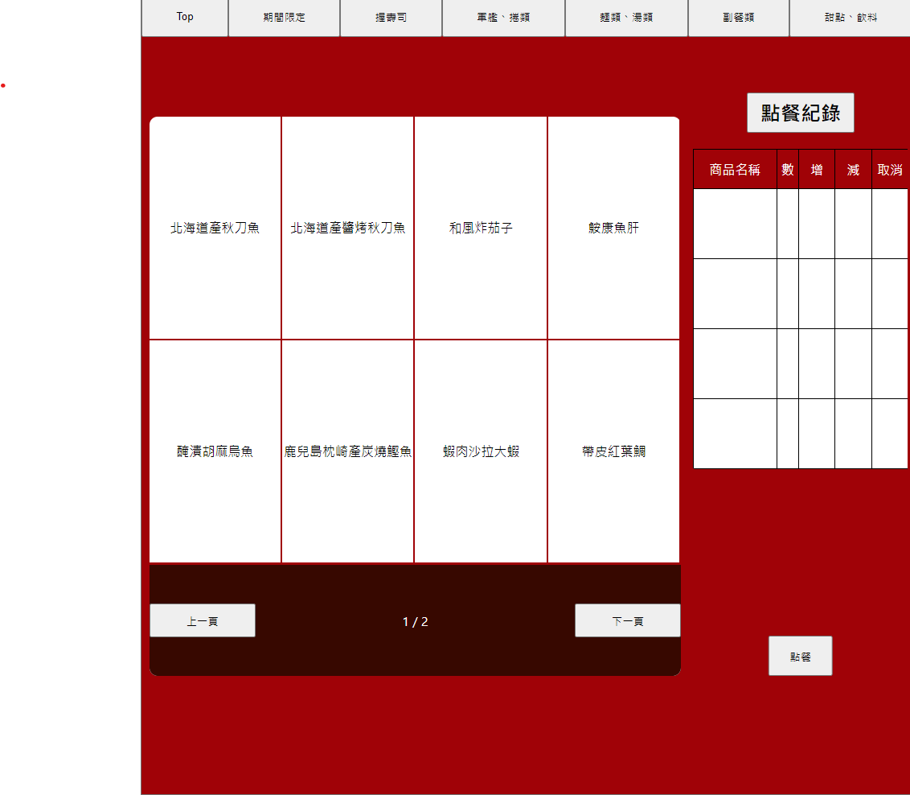
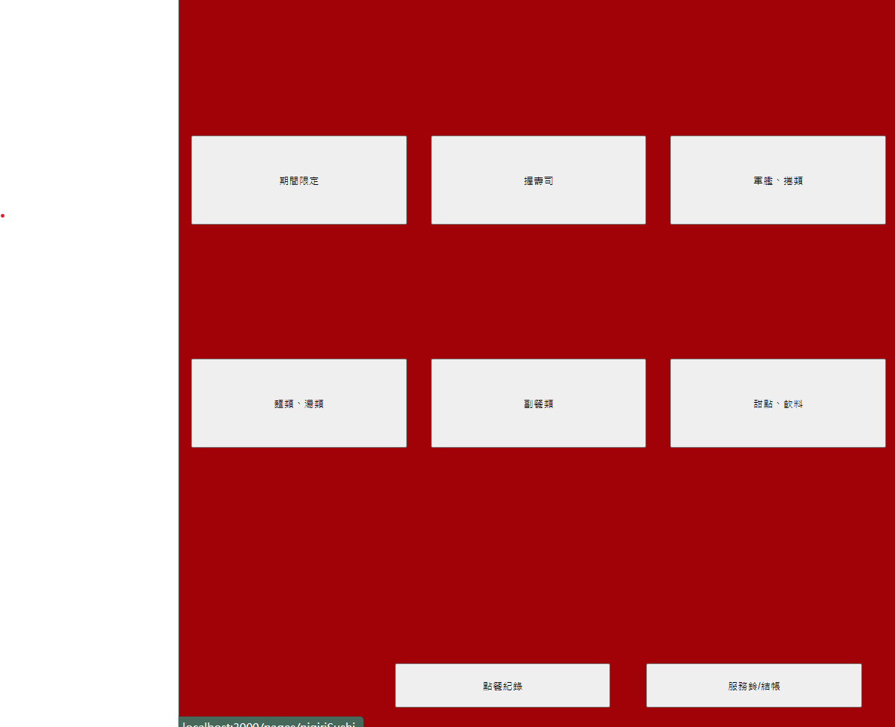
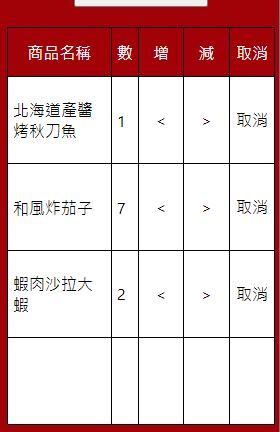
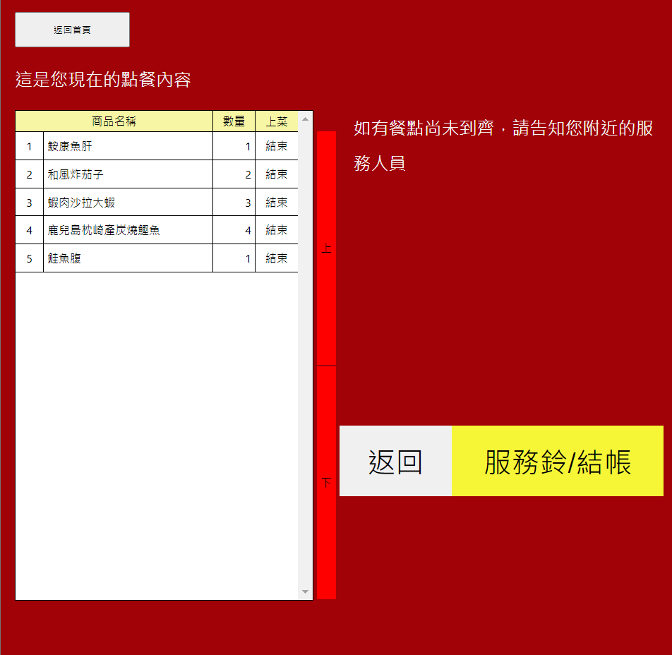
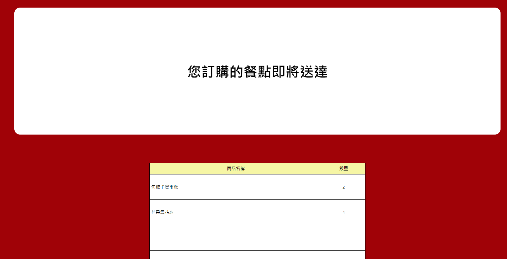

# 模仿某壽司餐廳所練習的點餐系統



此專案是使用 React.js 和 Node.js 簡單的串接 MYSQL 資料庫所完成的練習。

## 功能

- [x] 菜單的渲染
- [x] 點餐以及點餐數量的變更
- [x] 取消尚未送出的訂單
- [x] 紀錄點餐項目
- [x] 點餐中間的轉場以及結帳的轉場

## 畫面



首頁


點餐畫面



點餐



點餐紀錄



點餐過場畫面

## 安裝

### 取得專案

```
git clone https://github.com/CatYunnnn/orderingSystem.git
```

### 分別進入interface&server兩個資料夾安裝所需套件

```
npm install
```

### 資料庫

要事先在 MySQL Workbench 建立資料庫 資料庫設定如下

```
  host: "127.0.0.1",
  user: "root",
  password: "qwer1234asdf",
  database: "test",
```

### 產出種子資料

```
npm run seed
```

### 進入interface資料夾啟動前端伺服器

```
npm start
```

### 進入server資料夾啟動後端伺服器

```
npm run dev
```

### 開啟前端畫面

在瀏覽器網址列輸入以下網址即可看到畫面
```
http://localhost:3000/
```

## 資料夾說明

- interface - 前端
- server - 後端
  - config - 初始文件配置
  - models - 資料模型及種子
- picture - 圖片

## 開發工具

### 前端
- node.js 16.17.1
- react 18.2.0
- react-dom 18.20.0
- react-modal 3.16.1
- react-router-dom 6.17.0
- axios 1.5.1

### 後端

- node.js 16.17.1
- express 4.18.2
- mysql2 3.6.2
- cors 2.8.5